<div align="center">


### Achète, vends et échange entre étudiants — simplement.

[](https://flutter.dev)
[](https://firebase.google.com)
[](https://riverpod.dev)
[](https://pub.dev/packages/go_router)
[](https://github.com/Didi17ane/CampusMarket/actions)
[](#licence)

**Groupe 23 — FlutterFire Summer Camp 2026** · Catégorie *E-Commerce & Services Locaux*

</div>

---

## 📖 Sommaire

- [📖 Sommaire](#-sommaire)
- [🎯 À propos](#-à-propos)
- [✨ Fonctionnalités](#-fonctionnalités)
- [🛠 Stack technique](#-stack-technique)
- [🏗 Architecture](#-architecture)
- [📱 Captures d'écran](#-captures-décran)
  - [Authentification \& Navigation](#authentification--navigation)
  - [Catalogue \& Détail produit](#catalogue--détail-produit)
  - [Publication \& Gestion des annonces](#publication--gestion-des-annonces)
  - [Profil](#profil)
- [🚀 Démarrage rapide](#-démarrage-rapide)
  - [Prérequis](#prérequis)
  - [Installation](#installation)
  - [Configuration Firebase](#configuration-firebase)
  - [Variables d'environnement (`.env`)](#variables-denvironnement-env)
- [📂 Structure du projet](#-structure-du-projet)
- [👥 Équipe — Groupe 23](#-équipe--groupe-23)
- [🗺 Roadmap](#-roadmap)
- [📄 Licence](#-licence)

---

## 🎯 À propos

**CampusMarket** est une application mobile permettant aux étudiants de vendre et d'acheter des objets de seconde main directement entre eux (manuels, matériel électronique, vêtements, etc.). Chaque utilisateur peut publier une annonce en quelques secondes (photo à l'appui), parcourir le catalogue, filtrer par catégorie ou budget, et contacter un vendeur en un clic.

Projet réalisé dans le cadre du **FlutterFire Summer Camp 2026**, du 2 au 16 septembre 2026.

## ✨ Fonctionnalités

| Module | Description | Statut |
|---|---|:---:|
| 🔐 Authentification | Inscription / connexion sécurisée (Firebase Auth) | ✅ |
| 🏬 Catalogue | Parcours des annonces, filtres par catégorie & prix, recherche | ✅ |
| 📸 Publier une annonce | Formulaire complet + prise de photo (caméra/galerie) + upload Cloudinary | ✅ |
| 🗂️ Mes annonces | Gestion des annonces publiées (modifier, supprimer, statut) | ✅ |
| 🔎 Détail produit | Fiche complète d'un article, galerie photos, contact vendeur | ✅ |
| 👤 Profil | Informations du compte, modification, déconnexion | ✅ |
| 🍔 Navigation | Bottom nav + menu latéral (drawer) | ✅ |

## 🛠 Stack technique

- **Framework** : [Flutter](https://flutter.dev) (Dart)
- **Backend** : [Firebase](https://firebase.google.com) — Firestore (base de données), Firebase Auth (authentification)
- **Stockage images** : [Cloudinary](https://cloudinary.com)
- **Gestion d'état** : [flutter_riverpod](https://riverpod.dev)
- **Navigation** : [go_router](https://pub.dev/packages/go_router)
- **Typographie** : Google Fonts (Inter)
- **Architecture** : Clean Architecture (data / domain / presentation)

## 🏗 Architecture

Le projet suit les principes de la **Clean Architecture**, avec une séparation stricte par couche à l'intérieur de chaque fonctionnalité (`feature`) :

```
lib/
├── core/                     # Code partagé : thème, widgets communs, providers, routing
├── features/
│   ├── auth/                 # Authentification + Profil utilisateur
│   │   ├── data/             # Modèles, repositories (accès Firestore/Firebase Auth)
│   │   ├── domain/           # Use cases (logique métier)
│   │   └── presentation/     # Écrans, widgets, providers Riverpod
│   ├── annonces/             # Catalogue, publication, détail produit
│   └── mes_annonces/         # Gestion des annonces personnelles
├── routes/                   # Configuration go_router (routing centralisé + auth guard)
└── main.dart
```

**Flux de données** : `UI (Widgets)` → `Providers (Riverpod)` → `Repository` → `Firestore / Firebase Auth / Cloudinary`

## 📱 Captures d'écran

<div align="center">

### Authentification & Navigation
| Connexion | Inscription | Menu latéral |
|:---:|:---:|:---:|
| 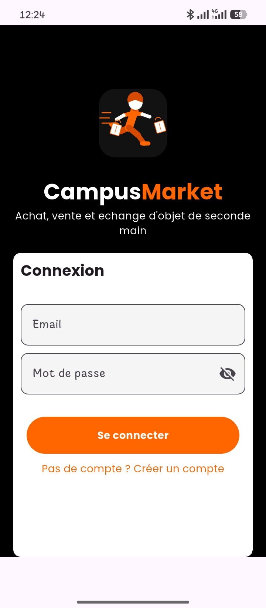 | 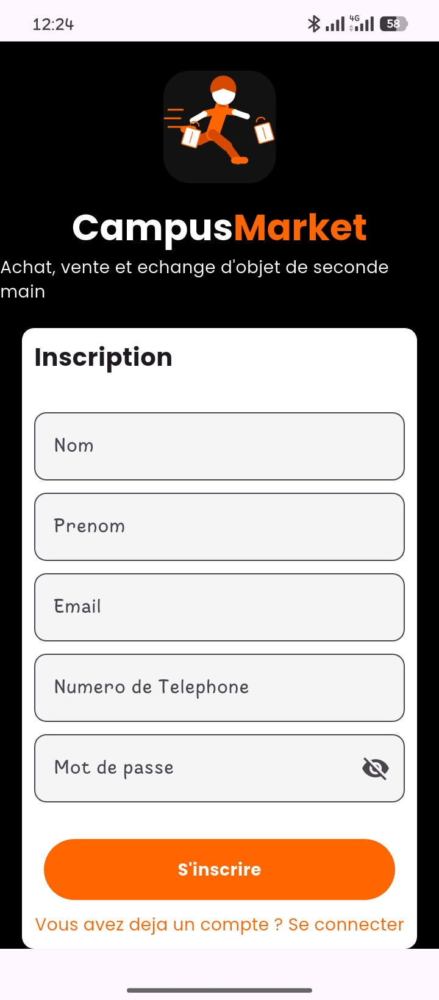 | 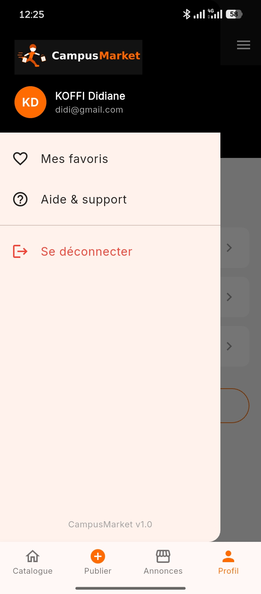 |

### Catalogue & Détail produit
| Catalogue | Détail produit | Commentaires |
|:---:|:---:|:---:|
| 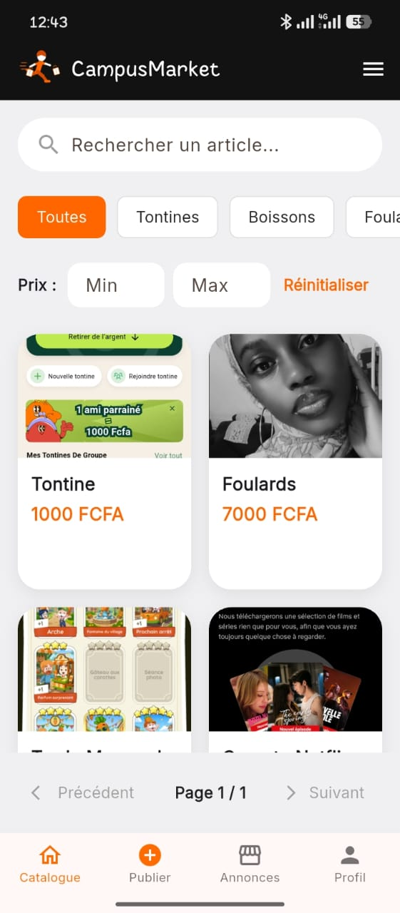 | 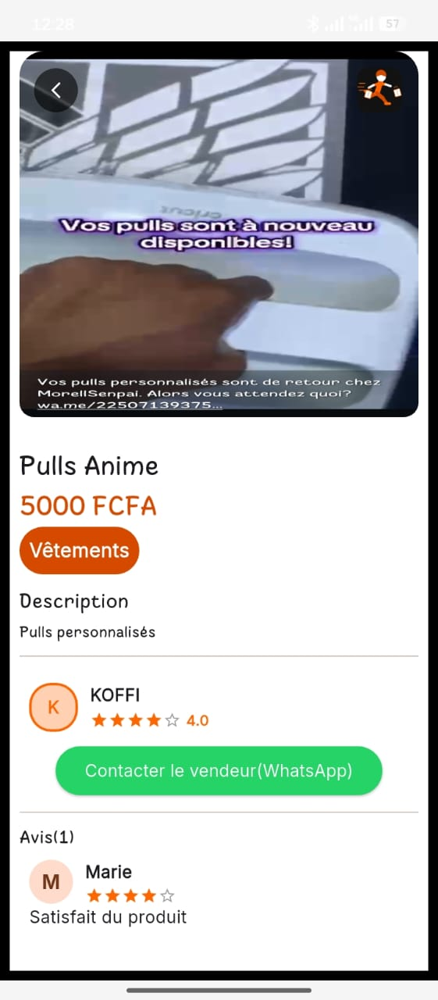 | 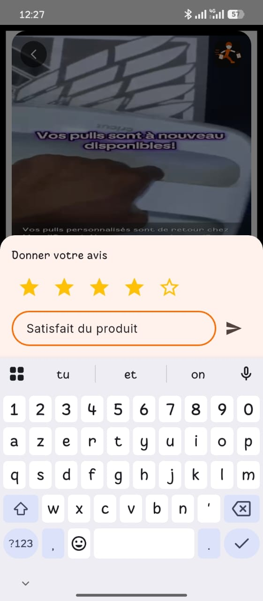 |

### Publication & Gestion des annonces
| Publier une annonce | Mes annonces | Modifier une annonce |
|:---:|:---:|:---:|
| 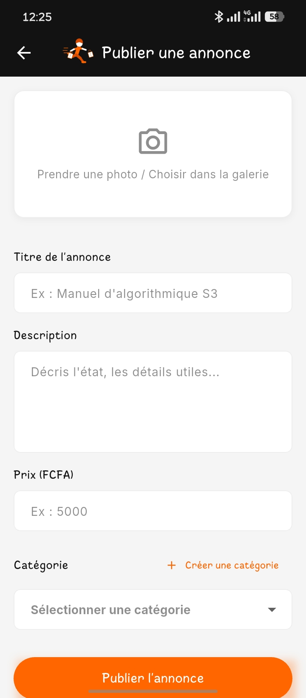 | 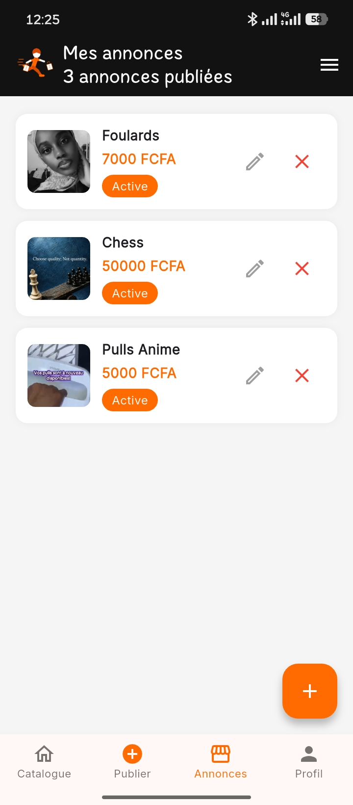 | 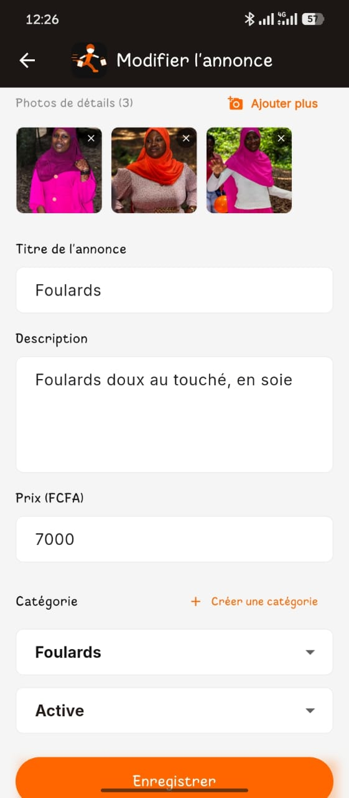 |

### Profil
| Profil | Modifier le profil |
|:---:|:---:|
| 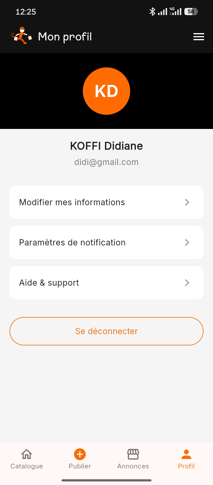 | 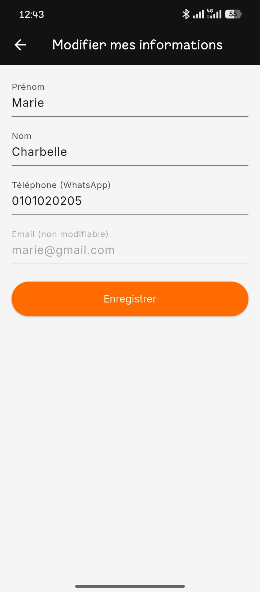 |

</div>

> Ajoute tes captures dans `docs/screenshots/` et remplace les cellules du tableau ci-dessus par
> `` (une ligne par écran).

## 🚀 Démarrage rapide

### Prérequis
- [Flutter SDK](https://docs.flutter.dev/get-started/install) (3.x)
- Un projet Firebase (Firestore + Authentication activés)
- Un compte [Cloudinary](https://cloudinary.com) (stockage des images)

### Installation

```bash
# 1. Cloner le repo
git clone https://github.com/Didi17ane/CampusMarket.git
cd CampusMarket

# 2. Installer les dépendances
flutter pub get

# 3. Configurer les variables d'environnement
cp .env.example .env
# puis renseigner tes clés Cloudinary dans .env

# 4. Générer les icônes de l'application
dart run flutter_launcher_icons

# 5. Lancer l'application
flutter run
```

### Configuration Firebase

Le fichier `lib/firebase_options.dart` est généré via la CLI FlutterFire :

```bash
dart pub global activate flutterfire_cli
flutterfire configure
```

### Variables d'environnement (`.env`)

```env
CLOUDINARY_CLOUD_NAME=xxxxxxxx
CLOUDINARY_UPLOAD_PRESET=xxxxxxxx
```

## 📂 Structure du projet

```
CampusMarket/
├── android/ ios/ web/         # Cibles de build par plateforme
├── assets/                    # Logos, icônes, images
├── lib/                       # Code source de l'application
├── test/                      # Tests unitaires & widgets
├── Ressources projet/         # Maquette Figma, détail des tâches
└── pubspec.yaml                # Dépendances du projet
```

## 👥 Équipe — Groupe 23

| Membre | Rôle |
|---|---|
| **Koffi Beugré Marie Didiane** | Cheffe de groupe · Profil, Mes annonces, Architecture & intégration |
| **N'Guessan Kouakou Yann Alex** | Modèles de données, Authentification |
| **Baba Traoré Hannatou** | Catalogue, Filtres |
| **Nomenjanahary Maddy Ruddy Anderson Billal** | Détail produit, Commentaires, Contact vendeur |
| **Maniga Topka Abou** | Publication d'annonce, Recherche |

*Mentor : David Bongouade*

## 🗺 Roadmap

- [ ] Support multi-photos par produit (au-delà de la photo principale)
- [ ] Règles de sécurité Firestore resserrées (post-authentification stabilisée)
- [ ] Messagerie interne acheteur/vendeur (au-delà du contact WhatsApp)
- [ ] Tests d'intégration end-to-end

## 📄 Licence

Projet académique réalisé dans le cadre du FlutterFire Summer Camp 2026. Usage éducatif.

---

<div align="center">
<sub>Fait avec 🧡 par le Groupe 23 — FlutterFire Summer Camp 2026</sub>
</div>